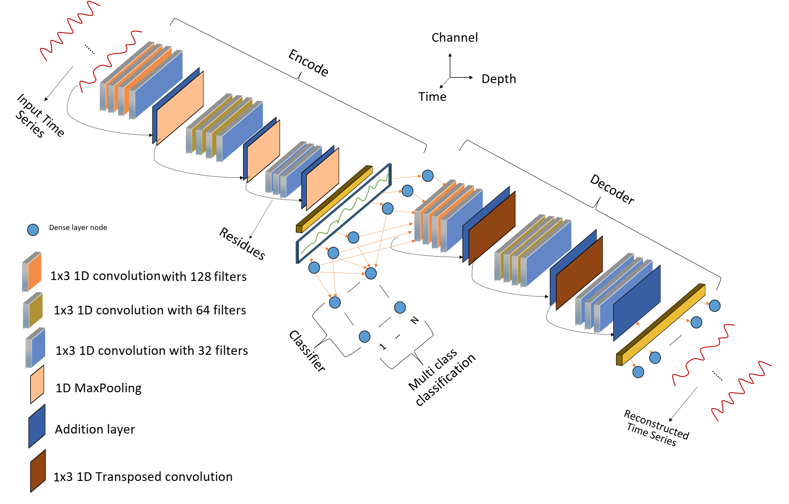

# Estimating-Time-Series-Averages-from-Latent-Space-of-Multi-tasking-Neural-Networks
This repository contains Python scripts used for the article *Estimating Time Series Averages from Latent Space of Multi-tasking Neural Networks* which is accepted at the [Journal of Knowledge and Information System (KAIS).](https://www.springer.com/journal/10115)

# Abstract

Time series averages are one key input to temporal data mining techniques such as classification, clustering, forecasting, etc. In practice, the optimality of estimated averages often impacts the performance 
of such temporal data mining techniques. Practically, an estimated average is presumed to be optimal if it minimizes the discrepancy between itself and members of an averaged set while preserving descriptive shapes. 
However, estimating an average under such constraints is often not trivial due to temporal shifts. To this end, all pioneering averaging techniques propose to align averaged series before estimating an average. 
Practically, the alignment gets performed to transform the averaged series, such that, after the transformation, they get registered to their arithmetic mean. However, in practice, most proposed alignment techniques 
often introduce additional challenges. For instance, Dynamic Time Warping~(DTW) based alignment techniques make the average estimation process non-smooth, non-convex, and computationally demanding. With such observation 
in mind, we approach time series averaging as a generative problem. Thus, we propose to mimic the effects of temporal alignment in the latent space of multi-tasking neural networks. We also propose to estimate~(augment) 
time domain averages from the latent space representations. With this approach, we provide state-of-the-art latent space registration. Moreover, we provide time domain estimations that are better than the estimates 
generated by some pioneering averaging techniques.

# Visual Demonstration of the Problem

 
 

 
 

# Proposed Architectures 
Overall, we proposed three multitasking autoencoders to estimate the averages of a range of temporal datasets obtained from the [University of California Univariate Time Series Repository (UCR).](https://www.cs.ucr.edu/%7Eeamonn/time_series_data_2018/) The multitasking architectures were trained to minimize multi-class classification and reconstruction losses. Moreover, architecturewise, we have used layer arrangments that were utilized in the VGG16, ResNet, and Inception architectures.   

 
 
  
(a).&nbsp; Proposed VGG16 based Multi-tasking Autoencoder&nbsp; &nbsp; &nbsp; &nbsp; &nbsp; &nbsp; &nbsp; &nbsp; &nbsp; &nbsp; &nbsp; &nbsp; &nbsp; &nbsp; &nbsp; &nbsp; &nbsp; &nbsp; &nbsp;  &nbsp; (b).&nbsp; Proposed ResNet based Multi-tasking Autoencoder

 

  (c).&nbsp; Proposed Inception based Multi-tasking Autoencoder
 

# Steps in Training the proposed Networks and Estimating Averages
* The proposed architectures were first trained using the train splits of 114 datasets obtained from the [UCR](https://www.cs.ucr.edu/%7Eeamonn/time_series_data_2018/). For each datasets, the networks optimized for multi-class catagorical cross entropy, reconstruction loss, and time domain and latent space qantile regression losses.
* After training the proposed architecures on a given [UCR](https://www.cs.ucr.edu/%7Eeamonn/time_series_data_2018/) dataset, the encoder portion of trained networks were then used to project the multi-class time domain dataset of a train split into the latent space. 
* After the projection, the per class atihimetic mean of the multi-class latent space embedding of the training split were taken as the estimate of the class averages.
* The per class latent space averages were then projected to the time domain using the decoder portion of the proposed trained multi-tasking autoencoders.
* Finally, to assess the quality of the estimated time domain per class averages, one nearest centroid classification was conducted using the estimated per class  latent space and time domain averages and the time domain and latent space embedding of test split of the [UCR](https://www.cs.ucr.edu/%7Eeamonn/time_series_data_2018/) datasets. 
